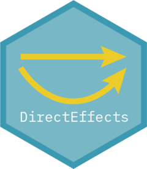

# DirectEffects <a href='https://mattblackwell.github.io/DirectEffects'></a>

<!-- badges: start -->

[](https://github.com/mattblackwell/DirectEffects/actions)
<!-- badges: end -->

## Overview

DirectEffects is an R package to estimate controlled direct effects
(CDEs), which are the effect of a treatment fixing a set of downstream
mediators to particular values. As of now, the package supports
sequential g-estimation and a two-stage matching approach called
telescope matching. For more information on how CDEs can be useful for
applied research and a brief introduction to sequential g-estimation,
see [Acharya, Blackwell, and Sen
(2016)](http://www.mattblackwell.org/files/papers/direct-effects.pdf).
For more on the telescope matching procedure, see [Blackwell and
Strezhnev
(2022)](https://www.mattblackwell.org/files/papers/telescope_matching.pdf).

## Installation

You can install DirectEffects via CRAN for the current stable version or
via GitHub for the development version.

``` r
# Installing from CRAN
install.packages("DirectEffects")

# Installing development version from Github:
# install.packages("devtools")
devtools::install_github("mattblackwell/DirectEffects", build_vignettes = TRUE)
```

## Usage

The main functions for estimating CDEs in DirectEffects are:

- [`sequential_g()`](https://mattblackwell.github.io/DirectEffects/articles/DirectEffects.html):
  estimate controlled direct effects using two-stage linear models.
- [`telescope_match()`](https://mattblackwell.github.io/DirectEffects/articles/telescope_matching.html):
  estimated controlled direct effects using a two-stage matching
  procedure with bias correction.

DirectEffects also provides diagnostics for these two approaches,
including sensitivity analyses and balance checks.
