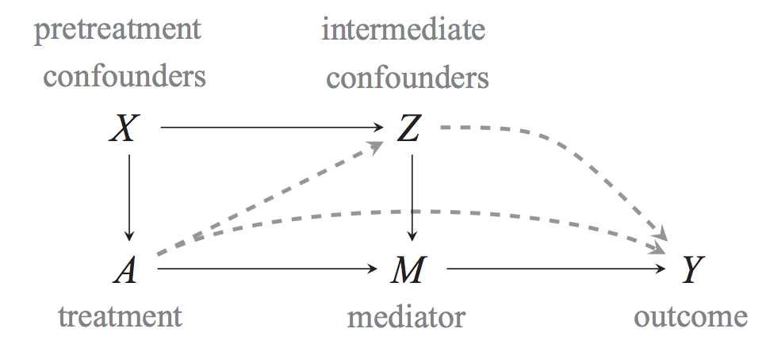

```{r loadpkg, echo = FALSE, include = FALSE}
knitr::opts_chunk$set(fig.width = 5, fig.height = 4, fig.align = "center")
library(dplyr)
library(scales)
library(reshape2)
library(ggplot2)
library(DirectEffects) 
```


This vignette demonstrates how to estimate the controlled direct effect of some treatment, net the effect of some mediator using the routines provided in `DirectEffects`, First, it discusses the sequential g-estimation approach as described by  @AchBlaSen16. With standard regression and matching approaches, estimating the controlled direct effect is difficult because it often requires adjusting for covariates that causally affect the mediator and are causally affected by the treatment. Including such variables in a regression model can lead to post-treatment bias when estimating the direct effect of treatment. A large class of models and estimation approaches have been developed to avoid this problem, but here we focus on one called sequential g-estimation. This approach uses a standard linear model to  estimate the effect of the mediator, and then removes that effect from effect from the dependent variable to estimate the direct effect of treatment without post-treatment bias. Second, it illustrates the telescope matching method developed in @BlaStr19 as implemented in the `telescope_matching` routine. One drawback of sequential g-estimation is that it depends on correctly specifying two regression models: one for the effect of the mediator given treatment and pre-/post-treatment covariates and another for the effect of treatment given pre-treatment covariates. Telescope matching provides a more flexible and less model-dependent estimation strategy for controlled direct effects when the treatment and mediator are binary. It combines a two-stage matching procedure to impute the unobserved counterfactuals with a bias-correction to account for biases induced by imperfect matches.

## Quantity of interest 

Here we briefly introduce some of the statistical theory behind estimating direct effects. The main quantity of interest is the average controlled direct effect or ACDE. This can be illustrated from the following causal structure [@AchBlaSen16, Figure 3]:

```{r, echo = FALSE, out.width = "600px", fig.align='center'}

```


The average controlled direct effect defined for a given treatment ($A_i = a$ vs. $A_i = a^\prime$) and a given value of the mediator ($M_i = m$) is 
$$ACDE(a, a^\prime, m) = E[Y_i(a, m) - Y_i(a^\prime, m)]$$
and is the total of the dashed lines in the figure above. Thus, we hold the mediator constant when comparing the outcome under each treatment. The ACDE is useful for discriminating between causal mechanisms, because the average total effect of treatment, $\tau(a, a^\prime) \equiv E[(Y_i(a) - Y_i(a^\prime)]$, can be decomposed as the sum of three quantities: (1) the ACDE, (2) the average natural indirect effect, and (3) a reference interaction that measures of how much the direct effect of $A_i$ depends on a particular $M_i = m$. Thus, if the ACDE is non-zero, it is evidence that the effect of $A_i$ is not entirely explained by $M_i$. We illustrate this with an empirical example. For more information on this, see @AchBlaSen16. 


## Estimation by sequential g-estimation

One way to estimate the ACDE with linear models is by sequential g-estimation, a type of structural nested mean model. The key logic of sequential g-estimation is that, under the sequential unconfoundedness assumption, the ACDE can be identified as follows:
$$E[Y_i(a, 0) - Y_i(0,0)|X_i = x] = E[Y_i - \gamma(a, M_i, x) | A_i = a, x] - E[Y_i - \gamma(0, M_i, x) | A_i = 0, x]$$

The function $\gamma$ above is called the "demediation function" (or "blip-down function") and is defined as follows:
$$\gamma(a, m, x) = E[Y_i(a, m) - Y_i(a, 0) | X_i = x]$$

This function is the effect of switching from some level of the mediator to 0, and thus is an estimate of the causal effect of the mediator for a fixed value of the treatment $a$ and within levels of the covariates. Subtracting its estimates $\gamma(A_i, M_i, X_i)$ from the outcome $Y_i$ will effectively remove the variation due to the mediator from the outcome, or what @AchBlaSen16 call "demediation." 

The identification of the ACDE hold under the sequential unconfoundedness condition, using the definitions by @AchBlaSen16.

**Assumption 1 (Sequential Unconfoundedness)** 

> First, no omitted variables for the effect of treatment ($A_i$) on the outcome ($Y_i$), conditional on the pretreatment confounders ($X_i$). Second, no omitted variables for the effect of the mediator on the outcome, conditional on the treatment, pretreatment confounders, and intermediate confounders ($Z_i$).


While the ACDE is estimated nonparametrically with just this assumption, we need to make a further assumption to be able to use sequential g-estimation. 

**Assumption 2 (No intermediate interactions)**

> The effect of the mediator ($M_i$) on the outcome ($Y_i$) is independent of the intermediate confounders ($Z_i$).

Without this assumption, we would have to model the multivariate distribution of the intermediate confounders in order to estimate the ACDE. 


### Estimating the demediation function

Under the assumption of sequential unconcoundedness, the demediation function can be estimated by a regression of the outcome on the variables in the demediation function ($M_i$) plus the intermediate confounders ($Z_i$), treatment ($A_i$), and baseline confounders ($X_i$). If this regression model is correctly specified, the coefficients on the variables in the demediation function are unbiased for the parameters of the demediation function. For example, when there are no interactions between the mediator and the treatment, nor between the mediator and the pretreatment confounders, the demediation function is straightforward to estimate. In this case, the demediation function is  $\gamma(a, m, x) = \alpha \times m$ and the OLS coefficient on the mediator is an the estimate of $\alpha$. 

### Using the demediation function to estimate ACDE

The second stage of sequential g-estimation uses the demediated outcome
$$\tilde{Y}_i = Y_i - \widehat{\gamma}(A_i, M_i, X_i; \widehat{\alpha}).$$
If there are no interactions or nonlinearities in the demediation function, then this becomes $\tilde{Y}_i = Y_i - \widehat{\alpha}M_i$. With this demediated outcome in hand, we can estimate the ACDE by regressing this outcome on the treatment and pre-treatment covariates:
$$E[\tilde{Y}_i | A_i, X_i] = \beta_0 + \beta_1A_i + X_i^T\beta_2.$$
Under the above assumptions and assuming this regression is correctly specified, the $\widehat{\beta}_1$  is an unbiased estimate of the ACDE. The `sequential_g` function that we demonstrate below will complete both the estimation of the demediation function and the estimation of the ACDE. For more technical details on sequential g-estimation, see @AchBlaSen16. 


## Illustrative example of sequential g-estimation

We now work through one example of using `sequential_g` to estimate the ACDE. The data comes from @AleGiuNun13. The dataset comes with the package:
```{r}
data(ploughs)
```

The paper's main argument is that the advent of the capital-intensive agricultural practice of the plow favored men over women participating in agriculture, which have affected gender inequality in modern societies. These authors find that strong effects of plow-based agriculture on female labor-force participation, but not on share of political positions held by women. The authors speculate that this might be due to the (positive) effects of the plow on modern-day income levels, which could offset the direct effects of the plow. The authors control for income and show that a significant effect of the plow appears. We evaluate this approach and try to estimate the ACDE more formally. Thus, in this case, we have the following variables, where $i$ indexes countries:


* $Y_i$ is the share of political positions held by women in 2000 (`women_politics`)
* $A_i$ is the relative proportion of ethnic groups that traditionally used the plow within a country (`plow`)
* $M_i$ is the log GDP per capita in 2000, mean-centered (`centered_ln_inc`)
* $Z_i$ are the post-treatment, pre-mediator intermediate confounders (`years_civil_conflict`, `years_interstate_conflict`, `oil_pc`, `european_descent`, `communist_dummy`, `polity2_2000`, `serv_va_gdp2000`)
* $X_i$ is the pre-treatment characteristics of the country, which are mostly geographic. (`tropical_climate`, `agricultural_suitability`, `large_animals`, `political_hierarchies`, `economic_complexity`, and `rugged`)

As a baseline, we first regress $Y_i$ on $A_i$ controlling for the pre-treatment variables $X_i$.
```{r}
ate.mod <- lm(women_politics ~ plow + agricultural_suitability +
                tropical_climate +  large_animals + political_hierarchies +
                economic_complexity + rugged, data = ploughs)
```

Notice that the effect of the plow is negative and insignificant.
```{r, echo = TRUE, eval = TRUE}
summary(ate.mod)
```


#### Implementation

In this example, we would like to estimate the controlled direct effect of plows fixing the value of the mediator, current national income. To do so, we must choose a value at which to fix this mediator. The standard sequential g-estimation approach will fix the value to 0, which is often not a substantively interesting value---it certainly is not for income or logged income. To avoid this problem, we use the mean-centered version of our logged income, `centered_ln_inc`, so that when we demediate with $m = 0$, it will be equivalent to demediation with $m$ set to the mean of logged national income. Furthermore, we also use a squared term of this centered mediator, `centered_ln_incsq`, so that we can include it in the demediation function to account for nonlinear effects of logged income. 

Next, we specify the main formula that contains a left-hand side that specifies the dependent variable, and a right-hand side that distinguishes between the baseline variables, the intermediate variables, and the variables in the demediation function. Each of these  sets of variables on the left-hand side is separated by the vertical bar `|`.  Thus, the formula will have the form `yvar ~ treat + xvars | zvars | mvars`. . For example, here we specify that the demediation variables are $M_i$ and $M_i^2$:
```{r}
form_main <- women_politics ~ plow + agricultural_suitability + tropical_climate +
  large_animals + political_hierarchies + economic_complexity + rugged |
  years_civil_conflict + years_interstate_conflict  + oil_pc + european_descent +
  communist_dummy + polity2_2000 + serv_va_gdp2000 |
  centered_ln_inc + centered_ln_incsq
```


`sequential_g()`, implements sequential g-estimation in the way outlined in the previous section. Specifically, it runs the  first stage model, constructs the demediator function, and passes it to the second-stage model. At its simplest, it takes in the formula and a data frame:

```{r, echo = TRUE, eval = TRUE}
direct <- sequential_g(form_main, data = ploughs)
```


### Output

As usual, we can use the `summary` function to the output of the `sequential_g` function:
```{r, echo = TRUE, eval = TRUE}
summary(direct)
```

The standard errors here are based on the asymptotic variance derived in @AchBlaSen16, but it is also possible to use the `boots_g` function to compute standard errors by a simple bootstrap:

```{r}
out.boots <- boots_g(direct)
summary(out.boots)
```


The coefficient on the treatment variable (here, `plow`), is the estimate of the ACDE. The results show a negative ACDE of plows---in other words, the effect of the plough is negative for fixed income levels. This controlled direct effect is larger in magnitude than the estimated the total effect:

```{r, echo = FALSE, fig.width= 7, fig.height=4}
df.coef <- rbind(summary(ate.mod)$coef["plow", ],
               summary(direct)$coef["plow", ]) %>% 
  as.data.frame()  %>%
  mutate(pos = c("ATE of Plows", "ACDE of Plows,\nvia sequential g-estimation"))

ggplot(df.coef, aes(x = Estimate, y = pos)) +
  geom_point() +
  geom_errorbarh(data = df.coef, aes(xmin = Estimate + 1.96*`Std. Error`, xmax = Estimate - 1.96*`Std. Error`), height = 0.1) +
  scale_x_continuous(limits = c(-10, 5)) +
  geom_vline(xintercept = 0, linetype = 2) +
  geom_text(aes(label = round(Estimate, 1)), nudge_y = 0.1) +
  theme_bw() +
  labs(x = "Estimated Causal Effects on Percent of Women in Political Office",
       y = "",
       caption = "Lines are 95% confidence intervals")
```

### Output attributes

There are various quantities and output objects available from the `sequential_g` function. As usual, the coefficient estimates from the second stage can be accessed using the `coef()` function:
```{r}
coef(direct)
```
One can access confidence intervals for the coefficients using the usual `confint` function:
```{r}
confint(direct, "plow")
```

The `vcov()` function returns the variance covariance-matrix that accounts for the first stage estimation, 
```{r}
vcov(direct)[1:3, 1:3]
```


### Sensitivity

The `cdesens` function can perform a sensitivity analysis to evaluate how the estimated ACDE changes for various levels of post-treatment confounding of the mediator-outcome relationship. Currently, this function only supports a model with only one mediator. 


```{r}
# update with only one mediator
direct1 <- sequential_g(women_politics ~ plow + agricultural_suitability + tropical_climate +
  large_animals + political_hierarchies + economic_complexity + rugged |
  years_civil_conflict + years_interstate_conflict  + oil_pc + european_descent +
  communist_dummy + polity2_2000 + serv_va_gdp2000 |
  centered_ln_inc,
  ploughs)
out_sens <- cdesens(direct1, var = "plow")
plot(out_sens)
```

The black line shows how the estimated ACDE would be at various levels of correlation between the mediator and outcome errors, while the gray bands show the 95% confidence intervals. Note that when this correlation is 0, we recover the estimated effect from `sequential_g`. See @AchBlaSen16 for more information. 

## Estimation by telescope matching

Telescope matching provides an alternative, less model-dependent approach to estimating the average controlled direct effect when both treatment and mediator are binary. The average controlled direct effect of interest is the effect of treatment versus control ($A_i = 1$ vs. $A_i = 0$) holding constant the mediator at $0$ ($M_i = 0$).
$$ACDE = E[Y_i(1, 0) - Y_i(0,0)]$$

Identification still depends crucially on the sequential unconfoundedness assumption **Assumption 1**, which states that there are no unobserved confounders of $A_i$ and $Y_i$ given pre-treatment covariates $X_i$ and that there are no unobserved confounders of $M_i$ and $Y_i$ given treatment $A_i$, pre-treatment covariates $X_i$ and post-treatment covariates $Z_i$. We can understand the process of estimating the ACDE as an imputation problem. Our estimator of the ACDE, $\hat{\tau}$ is simply the average of imputed potential outcomes for each unit in the sample.
$$\hat{\tau} = \frac{1}{N}\sum_{i=1}^N \left(\widehat{Y}_i(1,0) - \widehat{Y}_i(0,0)\right)$$

To obtain the imputations $\hat{Y}_i(1,0)$ and $\hat{Y_i(0,0)}$ for each unit, the telescope matching approach proceeds in two stages. The first step matches each unit with $M_i = 1$ to some user-specified number of units with $M_i = 0$ that share treatment status $A_i$ and are similar in both pre-treatment covariates $X_i$ and post-treatment covariates $Z_i$ as measured by some distance metric (in `telescope_match` we implement the Mahalanobis distance). Let $\mathcal{J}_L^m(i)$ denote the set of units matched to unit $i$. We define the following imputation for each unit's potential outcome fixing $M_i$ to 0.

$$ 
\widehat{Y}_i(A_i, 0) =\begin{cases} Y_i & \text{ if } M_i = 0 \\ \frac{1}{L} \sum_{\ell\in \mathcal{J}^m_L(i)} Y_{\ell} & \text{ if } M_i = 1\end{cases}
$$

In the second step, we match each unit to some number of units of the opposite treatment status with similar values of pre-treatment covariates $X_i$  Let $\mathcal{J}_L^a(i)$ denote the set of units matched to unit $i$ such that $A_j = 1 - A_i$ for all $j \in \mathcal{J}_L^a(i)$. We then use the first-stage imputations for either unit $i$ or its second-stage matches to impute the potential outcomes for each unit under treatment and control fixing the mediator to $0$.

$$ 
  \widehat{Y}_{i}(a,0) = \begin{cases}
    \widehat{Y}_{i}(A_i,0) & \text{if}\ A_i = a\\
    \frac{1}{L} \sum_{j\in \mathcal{J}^a_L(i)} \widehat{Y}_{j}(A_j,0) & \text{if}\  A_i = 1-a
\end{cases}
$$
Since matching is done with replacement, units may be used multiple times.  We define $K^m_L(i) = \sum_{k=1}^N \mathbb{I}\{i \in \mathcal{J}^m_L(k)\}$ as the number of times that unit $i$ is used as a match in stage and $K^a_L(i) = \sum_{j=1}^N \mathbb{I}\{i \in \mathcal{J}^a_L(j)\}$. Moreover, since units with $M_i = 0$ contribute indirectly to second stage matches we define $K^{am}_L(i) = \sum_{j=1}^N \mathbb{I}\{i \in \mathcal{J}^m_L(j)\}K^a_L(j)$ to denote the number of times a unit with $M_i = 0$ matched to a unit with $M_i = 1$ is implicitly used as a match in the second stage. This allows us to re-write the simple matching estimator as a weighted average $\widehat{\tau} = N^{-1} \sum_{i=1}^N (2A_i - 1)(1 - M_i)W_iY_i$ where the weight is defined as

$$
  W_i =  1 + \frac{K^a_L(i)}{L} + \frac{K^m_L(i)}{L} + \frac{K^{am}_L(i)}{L^2}
$$
These weights can be used as a diagnostic for assessing the variance of the estimator and whether particular observations have an extreme influence on the estimate through large weights, resulting in large variances. The `telescope_match` function returns each of the constituent matching counts along with the combined matching "weight" on each observation for use in diagnostic plots.

### Bias correction for matching

Matching estimators with a fixed number of matches exhibit bias even in large samples due to differences in the regression function between units and their matches evaluated at their respective covariate values @AbaImb11. While this bias converges in probability to $0$ as the sample size grows, the rate of convergence is slow enough that the bias terms dominate the distribution To address this, matching estimators for treatment effects typically incorporate a bias correction which adjusts the matched values by the estimated difference in regression functions. We incorporate a similar approach for correcting matching bias in our two-stage procedure. 

The bias of the simple matching estimator for $\hat{\tau}$ consists of two terms, a bias due to matching on the mediator ($B_L^m$) and a bias due to matching on treatment ($B_L^a$)

$$
 B^m_L = \frac{1}{N} \sum_{i=1}^N (2A_i - 1)M_i \left(1 + \frac{K^a_L(i)}{L}\right)  \left( \frac{1}{L} \sum_{{\ell} \in J^m_L(i)} \mu_{A_i0}(X_{\ell}, Z_{\ell}, A_i) - \mu_{A_i0}(X_i, Z_i, A_i) \right) 
$$

$$
  B^a_L = \frac{1}{N} \sum_{i=1}^N (2A_i - 1) \Bigg[\frac{1}{L} \sum_{j \in J^a_L(i)} \mu_{1-A_i,0}(X_i,1-A_i) - \mu_{1-A_i,0}(X_j,1-A_i)   \Bigg]
$$
Where $\mu_{am}(x,z,a) = E[Y(a,m) \mid X_i = x, Z_i = z, A_i = a]$ and $\mu_{am}(x,a) = E[Y_i(a,m) \mid X_i= x, A_i = a]$ denote the conditional expectations of the potential outcomes given two different conditioning sets (with and without $Z$). Under sequential ignorability, $\mu_{am}(x,z,a) = \mu(x,z,a,m) = E[Y_i \mid X_i= x, Z_i = z, A_i = a, M_i = m]$. The method implemented in `telescope_match` extends the bias correction strategy of @AbaImb11 to the two-stage setting. It estimates the two conditional expectation functions using regression estimators $\widehat{\mu}(x, z, a, m)$ and $\widehat{\mu}_{a0}(x, a)$. As shown in @BlaStr19, if the regression estimators are consistent for the true regression functions, then the estimated bias correction converges to the true bias. The rate of convergence is fast enough such that the bias can be ignored asymptotically.

### Inference

Obtaining valid standard errors in the matching context is difficult as matching with replacement induces dependencies between imputed potential outcomes. We provide two approaches for estimating standard errors. The first implements a version of the @OtsRai17 wild bootstrap for matching estimators, extended to the two-stage setting. The second (default) approach estimates the components of the asymptotic variance derived in @BlaStr19.

### Illustration of telescope matching

In this section, we illustrate the implementation of the telescope matching estimator as applied to the Job Corps experiment data used in @Hub14 to estimate the effect of a randomized job training program on self-assessed health holding constant the intermediate outcome of employment. 

The data is supplied along with the package.
```{r}
data(jobcorps)
```

* $Y_i$ is an indicator for whether participants reported "very good" health after 2.5 years out after randomization (`exhealth30`)
* $A_i$ is an indicator for assignment to the job training program (`treat`)
* $M_i$ is an indicator for employment 1 to 1.5 years after assignment (`work2year2q`)
* $Z_i$ are the post-treatment, pre-mediator intermediate confounders (`emplq4`, `emplq4full`, `pemplq4`, `pemplq4mis`, `vocq4`, `vocq4mis`, `health1212`, `health123`, `pe_prb12`, `pe_prb12mis`, `narry1`, `numkidhhf1zero`, `numkidhhf1onetwo`, `pubhse12`, `h_ins12a`, `h_ins12amis`)
* $X_i$ is the pre-treatment characteristics (`chobef`, `trainyrbef`, `jobeverbef`, `jobyrbef`, `health012`, `health0mis`,`pe_prb0`, `everalc`, `alc12`, `everilldrugs`, `age_cat`, `eduhigh`, `rwhite`, `everarr`, `hhsize`, `hhsizemis`, `hhinc12`, `hhinc8`, `fdstamp`, `welf1`, `welf2`, `publicass`)

The original @Hub14 paper looks at separate controlled effects for female and male participants. We start by subsetting the dataset down to the female participants

```{r}
jobcorps_female <- subset(jobcorps, female == 1)
```

We define the two formula objects used for matching, the first including all pre- and post-treatment covariates $X_i$ and $Z_i$ along with all treatment-covariate interactions. The second includes only the pre-treatment covariates and treatment-covariate interactions.

```{r}
## Telescope matching formula - First stage (X and Z)
tm_form <-  exhealth30 ~ schobef + trainyrbef + jobeverbef +
  jobyrbef + health012 + health0mis +  pe_prb0 +  everalc + alc12 +
  everilldrugs + age_cat +  eduhigh +  rwhite + everarr + hhsize +
  hhsizemis + hhinc12 + hhinc8 + fdstamp + welf1 + welf2 +
  publicass | treat | emplq4 + emplq4full + pemplq4 + pemplq4mis +
  vocq4 + vocq4mis + health1212 + health123 + pe_prb12 +
  pe_prb12mis  + narry1 + numkidhhf1zero + numkidhhf1onetwo +
  pubhse12 + h_ins12a + h_ins12amis | work2year2q

```

By default, the `telescope_match()` function will estimate the effect of the treatment holding the mediator value at $0$. Here, this corresponds to estimating the effect of assignment to the jobs program (among women) on self-assessed health holding intermediate employment status at "unemployed." 

```{r}
### Estimate ACDE for women holding employment at 0
telescopeMatch.result.0 <-  telescope_match(
  tm_form,
  data = jobcorps_female, L = 3,
  boot = FALSE, verbose = TRUE, ci = 95)
```

The `summary()` function will print the output (estimate + standard error and confidence interval) to the console. The elements of the output can be accessed directly from the returned `tmatch` object.

```{r}
# Prints the summary output
print(summary(telescopeMatch.result.0))

# The coefficients + SE can be accessed directly as well
telescopeMatch.result.0$estimate # Point estimate
telescopeMatch.result.0$std.err #Standard error
```

Additional diagnostics can be conducted by calling the `balance.tmatch()` function on the returned `tmatch` object to assess the change in pre-/post-matching covariate balance in both the first and second stages.

```{r}

## Assess mediator balance on selected pre- and post- treatment covariates
balance.tmatch(telescopeMatch.result.0, vars = work2year2q ~ schobef + emplq4, data=jobcorps_female)

## Assess treatment balance on selected pre-treatment covariates
balance.tmatch(telescopeMatch.result.0, vars = treat ~ trainyrbef + hhsize, data=jobcorps_female)
```

Calling the `plotDiag.tmatch()` function will return a histogram of the number of times each unit is used as a match ($K/L$) in either the first (mediator) stage or the second (treatment) stage.

```{r, fig.width=7, fig.height=5}

# Number of times each unit is used as a match in the mediator (first) stage
plotDiag.tmatch(telescopeMatch.result.0, stage="mediator")

# Number of times each unit is used as a match in the treatment (second) stage
plotDiag.tmatch(telescopeMatch.result.0, stage="treatment")

```

## References 


